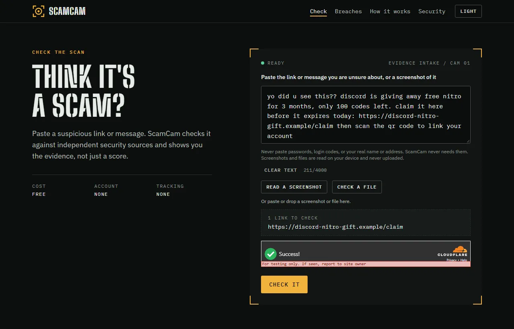
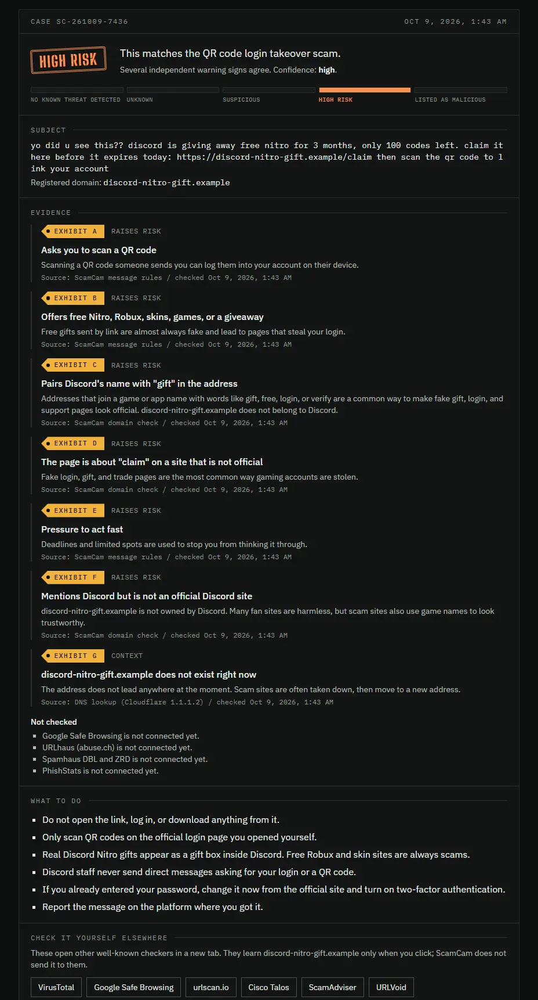
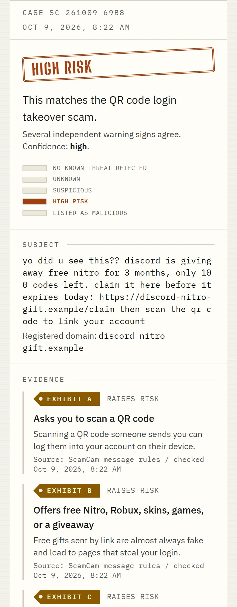
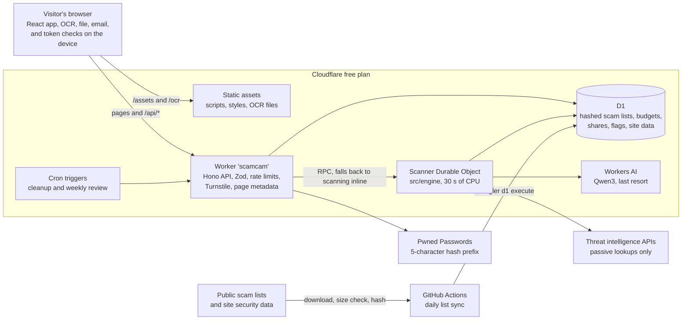
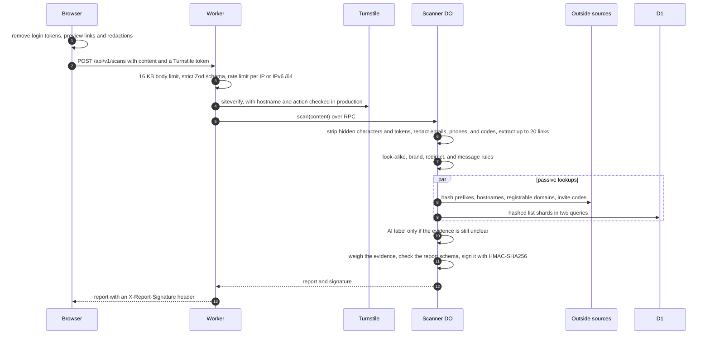
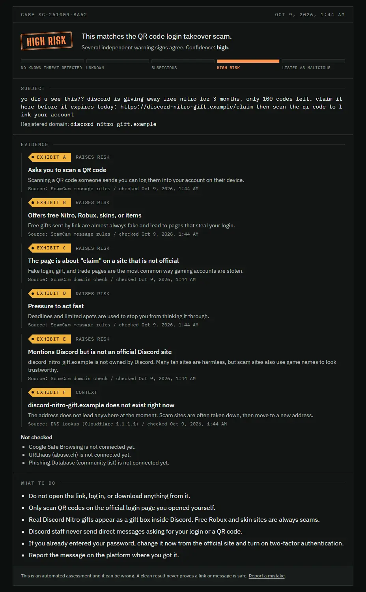
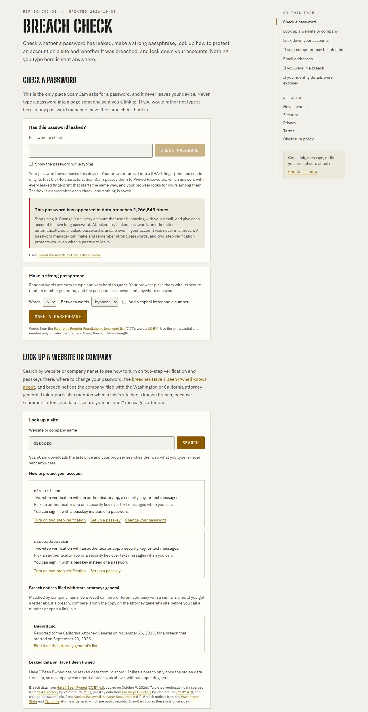

# ScamCam - Check the Scan

**A free scam checker for links, messages, screenshots, emails, and files that shows the evidence behind every
answer.** I designed, built, and run it on my own, on a $0 budget.

**Live at [scamcam.kevinle.tech](https://scamcam.kevinle.tech)** since October 5, 2026, on Cloudflare's free plan.

**Stack:** TypeScript (strict) | React 19 | Vite | Tailwind CSS 4 | Hono, Zod, and OpenAPI | Cloudflare Workers, a
Durable Object, D1, Workers AI, and Turnstile | GitHub Actions



<sub>The home page with a made-up "free Nitro" message. Before anything is sent, the browser shows which links will be
checked and which emails, phone numbers, and codes will be hidden. Captured from a local build that uses Cloudflare's
Turnstile test key.</sub>

## Why I built it

I'm a cybersecurity student focused on security operations and cloud security. ScamCam started with the scams that
target gamers: fake Steam trade links, "free Nitro" gifts, "I accidentally reported you" scripts, fake Minecraft mods,
and "can you test my game?" malware on Discord. Gaming audiences include a lot of teenagers, and ScamCam is meant for
anyone who cannot pay for a security product. It now also covers the scams that often come with no link at all, such
as fake investments, bank and government calls, tech support, job offers, and invoices.

Three rules shaped every design decision:

- **Evidence, not a score.** Every report lists each finding with its source and time, says how sure it is, and names
  the checks it could not run. A clean result never says "safe".
- **Privacy first.** No accounts, no trackers, and no cookies from ScamCam's pages or API. Submitted text is checked
  and thrown away. Screenshots, files, and saved emails are read on the visitor's device instead of being uploaded,
  and a password check sends only 5 characters of a hash.
- **$0 to run.** Everything fits inside the Cloudflare Workers Free and GitHub Free allowances. That constraint (10 ms
  of CPU and 50 subrequests per request) drove most of the architecture below.

## What it checks

| Input | What ScamCam does |
|---|---|
| Links | Look-alike and punycode domains, brand names on the wrong domain, game names joined with words like gift or login, redirect wrappers (Steam's link filter, Google, Safe Links) decoded offline, and Bitly, is.gd, and v.gd links expanded through those services' own APIs. A submitted link is never opened |
| Messages | 48 rules in 24 scam families, from login code requests and QR code logins to wallet drainers, fake staff, "safe account" transfers, and fake job offers |
| Reputation | Google Safe Browsing v5, abuse.ch URLhaus and ThreatFox, Spamhaus DBL and ZRD, PhishStats, Cloudflare's 1.1.1.2 security filter, RDAP domain age, and six community scam lists kept as hashed shards in D1 |
| Accounts | Discord invites (server age, verification, staff impersonation), Steam profiles (trade bans, new accounts), and GitHub repositories (age, removed or blocked) |
| Screenshots | Text read with Tesseract.js and QR codes read with jsQR, in the browser |
| Files and mods | Real file type, disguised endings, macros, packed Python programs, and Minecraft mods that behave like account stealers, found in the browser. Only fingerprints (and a mod's ID) go out, to MalwareBazaar, CIRCL hashlookup, Team Cymru, and Modrinth |
| Saved emails | The .eml is read in the browser, including the SPF, DKIM, and DMARC results the receiving server recorded |
| Phone numbers and wallets | Compared with hashed copies of the FTC's and FCC's complaint lists and ScamSniffer's scam wallets, never sent anywhere |
| Passwords | [/breaches](https://scamcam.kevinle.tech/breaches) checks Pwned Passwords by k-anonymity, and a site lookup shows two-step and passkey options, change-password links, and breach notices |
| Unclear messages | Only when the rules cannot decide, a small open model (Qwen3 on Workers AI) adds one label. It can add a warning but never lower a result |

Reports can be shared through links that expire in 5 to 15 minutes and flagged for my review, and a suspicious one
ends with a copy-ready "Report it" summary. A browser extension for Edge and Chrome adds "Check with ScamCam" to the
right-click menu.

<table>
  <tr>
    <td width="68%"></td>
    <td></td>
  </tr>
  <tr>
    <td><sub>The report for that message: a verdict stamp, a five-step risk meter written in words, and lettered exhibits
    with their sources. This local build has no outside keys, so the keyed sources show up under "Not checked".</sub></td>
    <td><sub>The same report on a phone, in the light theme.</sub></td>
  </tr>
</table>

## Architecture



- **One Worker, one Durable Object.** The free plan gives a Worker 10 ms of CPU per request, and the first live scans
  used 11 to 29 ms. I kept the Worker as a thin front door (validation, rate limits, Turnstile) and moved
  the engine into the `Scanner` Durable Object, which the free plan gives 30 seconds of CPU per request. If the
  scanner fails, the Worker logs a `scanner_unavailable` alert and scans by itself, so every scan path stays under 50
  subrequests.
- **Static first.** Scripts, styles, and the self-hosted OCR files are served as static assets. Pages pass through the
  Worker only to get their own titles, descriptions, and real 404s.
- **Lists live in D1, not in the request.** A GitHub Actions job downloads nine public lists every day (six of scam
  domains, two of reported phone numbers, and one of scam wallets), checks their sizes, and loads them as hashed
  shards. The six domain lists held about 1.2 million entries at their first full sync on 2026-10-07. A scan checks
  all of them in two D1 queries.
- **Engine with no platform code.** `src/engine` has no Worker-specific code. Each source is its own module with a
  timeout, a size cap, a Zod schema, and a typed result that always includes "unavailable".

Design decisions and the threat model are in [docs/ARCHITECTURE.md](docs/ARCHITECTURE.md).

### How a scan works



## Security and privacy engineering

Everything here is in the code and covered by tests. My self-review against the OWASP API Security Top 10 (2023) and
ASVS 5.0 fixed 11 findings ([docs/SECURITY_REVIEW.md](docs/SECURITY_REVIEW.md)), and the AI step is mapped to the
OWASP Top 10 for LLM Applications 2026 ([docs/OWASP_LLM_TOP_10.md](docs/OWASP_LLM_TOP_10.md)). It is a self-review,
not an independent penetration test.

- **No SSRF surface by design.** ScamCam never fetches a submitted URL. Outside calls go only to fixed provider hosts,
  and each source receives the least it needs: Safe Browsing gets 4-byte hash prefixes, URLhaus a hostname, RDAP a
  registrable domain. A test submits cloud metadata, loopback, and private addresses and checks that none is contacted
  ([test/worker/security.test.ts](test/worker/security.test.ts)). The full list of what each party receives is in
  [docs/PRIVACY_DESIGN.md](docs/PRIVACY_DESIGN.md).
- **Login tokens are removed before the request.** Discord tokens, Roblox's `.ROBLOSECURITY` cookie, Steam login
  cookies, and GitHub tokens are replaced in the browser before the text is sent
  ([ScanPanel.tsx](src/client/components/scan/ScanPanel.tsx#L272)), and again on the server before links are read
  ([extract.ts](src/shared/extract.ts#L109)), so no part of a token can reach a source, the AI step, or a shared
  report ([src/shared/secrets.ts](src/shared/secrets.ts)).
- **k-anonymity for passwords.** The browser sends only the first 5 of 40 hex characters of the password's SHA-1. The
  Worker asks Pwned Passwords with `Add-Padding` and adds 0 to 200 random padding lines of its own, so the content
  security policy keeps `connect-src 'self'` and Have I Been Pwned never sees the visitor's IP address.
- **Nothing sensitive is uploaded.** Screenshots, files, mods, and emails are parsed in the browser with bounded reads
  (for example a 64 KB file head, at most 20 MB scanned, and decompression bomb checks before an image is decoded).
  For a file, the API accepts only fingerprints, a size, a type, and finding codes from a fixed list, and it refuses
  unknown fields such as a file name.
- **Abuse resistance.** Turnstile on every scan, verified on the server, failing closed, and tied to the hostname and
  the `scan` or `flag` action. Rate limits per visitor with IPv6 grouped by /64. Daily budgets per source counted
  exactly in D1, so a flood degrades to "not checked" instead of spending a free quota.
- **Reports that cannot be forged.** Every report is signed with HMAC-SHA256. Sharing needs a valid signature on an
  unchanged report from the last 30 minutes, and shared reports are encrypted with AES-GCM under a random 128-bit key
  that lives only in the link's `#` fragment, so ScamCam's database cannot read them.
- **Flags can never make a scam look safe.** A flag goes into a review queue that nothing in the verdict path reads,
  and a config test enforces that (see the excerpt below).
- **False positives on shared hosts.** A live scan of a GitHub repository once came back "Listed as malicious" because
  URLhaus lists malware files on github.com. Code and file sharing sites now count as shared hosts, where a host
  listing is context and only a listing of the exact link confirms.
- **Prompt injection.** The model sees redacted text with links replaced by `[link]`, between markers the message
  cannot contain. Only one known label is accepted, it can never lower a result, and messages that try to instruct
  checkers skip the model and raise a warning instead.
- **Browser hardening.** A strict CSP with no `unsafe-inline` or `unsafe-eval` (only `wasm-unsafe-eval` for OCR),
  `frame-ancestors 'none'`, HSTS, COOP, CORP, `nosniff`, `Referrer-Policy: no-referrer`, and a restrictive
  `Permissions-Policy` ([public/_headers](public/_headers)).
- **Sources chosen by their terms.** I read each provider's terms before using it. VirusTotal, urlscan.io, and Hybrid
  Analysis restrict showing their results to others, so reports link to their public pages for the visitor to open.
  Cloudflare URL Scanner was ruled out because it visits the submitted URL
  ([docs/API_LICENSE_MATRIX.md](docs/API_LICENSE_MATRIX.md)).
- **Logs and supply chain.** Logs keep fixed fields only (no IPs, messages, or links), Cloudflare's invocation logs are
  off, and request IDs are made by the Worker. Dependencies use exact versions; CI runs `npm audit`,
  `npm audit signatures`, a CycloneDX SBOM, and Gitleaks, and a test fails if a GitHub Action is not pinned to a commit.

## Engineering highlights

**The password never leaves the device.** The browser hashes it, sends a 5-character prefix, and finds the match in
the answer itself ([src/client/lib/breach-check.ts](src/client/lib/breach-check.ts#L12-L28)):

```ts
export async function checkPassword(password: string, fetcher: typeof fetch = (input, init) => fetch(input, init)): Promise<PasswordResult> {
  const hash = await sha1Hex(password);
  let response: Response;
  try {
    response = await fetcher(`/api/v1/passwords/range/${hash.slice(0, 5)}`, { headers: { Accept: "text/plain" }, cache: "no-store", referrerPolicy: "no-referrer" });
  } catch {
    return { status: "unavailable" };
  }
  if (response.status === 429) {
    return { status: "rate_limited" };
  }
  if (!response.ok) {
    return { status: "unavailable" };
  }
  const count = rangeCounts(await response.text()).get(hash.slice(5));
  return count ? { status: "found", count } : { status: "not_found" };
}
```

**Scans run where the CPU is, with a fallback.** The Worker calls the `Scanner` Durable Object over RPC. If it fails
or its free quota runs out, the Worker records only the error type and scans by itself
([src/worker/routes/scan-gate.ts](src/worker/routes/scan-gate.ts#L48-L58)):

```ts
export async function inScannerOrInline<T>(c: Context<AppEnv>, remote: (namespace: Env["SCANNER"]) => Promise<T>, inline: () => Promise<T>): Promise<T> {
  if (c.get("scans") === "inline" || !c.env.SCANNER) {
    return inline();
  }
  try {
    return await remote(c.env.SCANNER);
  } catch (error) {
    logEvent("alert", { task: "scan", alert: "scanner_unavailable", reason: error instanceof Error ? error.name : "unknown" });
    return inline();
  }
}
```

**Over a million list entries on a free database.** Writing one row per domain would blow through D1's free write quota
on every sync, and loading the lists into a Worker would blow through its CPU. Each list is instead stored as 1,024
shards of sorted 8-byte SHA-256 prefixes, so a sync writes about 1,025 rows per list and a lookup reads one shard and
binary-searches it ([src/engine/domain-list.ts](src/engine/domain-list.ts#L161-L168)):

```ts
export async function domainListKey(name: string): Promise<Uint8Array> {
  const digest = await crypto.subtle.digest("SHA-256", new TextEncoder().encode(name));
  return new Uint8Array(digest, 0, domainListKeyBytes);
}

export function shardOf(key: Uint8Array): number {
  return (key[0]! << 2) | (key[1]! >> 6);
}
```

**Security invariants enforced as tests.** If a bot could flag a scam site until it looked safe, the flag feature would
be an attack. This test fails the build if any file other than the flag route and the maintenance job touches the flags
table ([test/node/config.test.ts](test/node/config.test.ts#L146-L153)):

```ts
test("result flags are kept for review only, and nothing that makes a verdict reads them", () => {
  const relative = (path: string) => path.split(sep).join("/").replace(/^.*?\/src\//, "src/");
  const sources = projectFiles().filter((path) => relative(path).startsWith("src/"));
  const touchesTable = sources.filter((path) => readFileSync(path, "utf8").includes("result_flags")).map(relative).sort();
  assert.deepEqual(touchesTable, ["src/worker/repositories/maintenance.ts", "src/worker/repositories/result-flags.ts"]);
  const importsFlags = sources.filter((path) => /from "[^"]*result-flags"/.test(readFileSync(path, "utf8"))).map(relative).sort();
  assert.deepEqual(importsFlags, ["src/worker/maintenance/tasks.ts", "src/worker/routes/flags.ts"]);
});
```

Problems I hit in production and how I fixed them:

| Problem | Fix |
|---|---|
| Safe Browsing kept one cache entry per hash prefix, so a 20-link message needed about 750 subrequests against a limit of 50 | Answers live in memory first and the shared cache is capped per request. The same message now uses 39 |
| Most of the first scan's CPU time was one-time setup (11.6 ms for the first scan, 0.2 ms after) | The Worker warms up its patterns, rules, and report schema at startup, and the engine moved into the Durable Object |
| Unfinished timeout timers kept the Durable Object busy for about 5 seconds after each scan with lookups, spending its free duration about ten times faster than needed | Every lookup clears its timer when it finishes ([src/engine/deadline.ts](src/engine/deadline.ts)) |
| Cloudflare refuses Workers' TCP connections to outside DNS servers, which broke Spamhaus lookups in production | Queries go over DNS over HTTPS (RFC 8484, POST) through Cloudflare's resolver, with the access key in the request body, never in a URL or a log |
| Crafted 4,000-character inputs made link and email extraction take up to about 23 ms | Cheap checks first and patterns whose time grows in step with input length. 31 crafted and 300 fuzzed inputs now run in a test, and the worst takes under 1 ms |
| Safe Browsing v5 answers only in binary Protocol Buffers | A small reader that rejects malformed input, checked against Google's live answers ([src/engine/protobuf.ts](src/engine/protobuf.ts)) |
| The domain's Cloudflare Web Analytics setting injected an analytics beacon into ScamCam's pages at launch | Pages send `Cache-Control: no-transform`, and the live check confirms no analytics request is made |
| A phone photo of an installer screen was checked as if `Resume.docx`, a file name in the window behind it, were a website | A link written without `http://` or `https://` is checked only when it ends in a real domain ending from the public suffix list ([src/engine/url-analysis.ts](src/engine/url-analysis.ts)), and a test replays that photo's text |

## Measured results

I ran these on 2026-10-09 with outside sources off or faked, so they measure ScamCam's own rules and limits.

| Test | Result |
|---|---|
| Labeled benchmark (88 cases: 47 scams, 41 safe) | Precision 1.000 and recall 1.000. This is a tuning set, not an independent evaluation |
| Held-out real phishing domains (Phishing.Database commit `12a20bf`, seed 20261007), rules only | 94 of 200 gaming-impersonation domains flagged and 0 of 178 legitimate sites. General phishing with no game name is left to the lists and Safe Browsing, so the rules alone flagged 0 of 200 random phishing domains |
| Subrequests for a message with 20 links | 39 in the Worker fallback (12 fetches, 20 cache calls, 7 D1 queries), 29 in the scanner with every source on, and 38 with Discord invites, Steam profiles, Bitly links, and a GitHub repository among them. The limit is 50 |
| Subrequests for the benchmark cases | 5.55 per first scan on average (13 at most), and 0 for a repeat |
| Engine time per scan in Node (fake network) | 1.04 ms at the median and 3.35 ms at the 95th percentile for a first scan |

Two earlier one-time runs are recorded in [docs/STATUS.md](docs/STATUS.md#benchmarks) and
[docs/SCAMCAM_ANALYSIS.md](docs/SCAMCAM_ANALYSIS.md): on a 20-scam, 20-message holdout set, the rules alone caught 3
scams and the rules with the AI step caught 16, with no false alarms (2026-10-05), and 61 real files from Modrinth,
including the 40 most downloaded mods, were not flagged (2026-10-07). The known gaps are written down too: the rules
alone still miss 106 of the 200 held-out gaming domains, mostly game names in front of unrelated sites (a pattern
communities also use for their own invite pages) and heavy misspellings.

## Testing and CI

| Check | Command | Result on 2026-10-09 |
|---|---|---|
| Strict type check | `npm run typecheck` | Passes |
| Worker, engine, and client tests (Vitest, Worker tests inside workerd with a real local D1 and a fake network that records every outgoing request) | `npm run test:worker` | 890 tests in 60 files pass |
| Config and script tests (cron parity, CSP, pinned Actions, no em dashes or hidden characters, flags isolation) | `npm run test:config` | 34 pass |
| Accessibility: axe-core WCAG 2.2 AA on every page, both themes, 1280 and 320 px, plus real scan, flag, email, and breach flows | `npm run test:a11y` | 72 checks pass |
| Privacy and headers: a real Chrome visits 13 pages, scans, flags, shares, reads a screenshot, checks a file, a mod, an email, and a password, and fails on any outside origin, cookie, stray storage, or leaked text; plus headers on 25 static paths and 4 API answers and a secret scan of 63 built files | `npm run test:privacy` | Passes. Only ScamCam and `challenges.cloudflare.com` were contacted, no cookies, and only `scamcam-theme` stored |
| Backup and restore drill on a throwaway local database | `npm run test:recovery` | All 11 tables and the 10-migration history matched (export 1.0 s, 647 KB; restore 3.1 s) |

GitHub Actions runs four jobs on every push and pull request ([.github/workflows/ci.yml](.github/workflows/ci.yml)):
`check` (generated types, type check, tests, build, restore drill, `npm audit`, registry signatures, SBOM),
`accessibility`, `privacy`, and `secrets` (Gitleaks). A second workflow syncs the scam lists every day at 07:37 UTC.
How each suite works is in [docs/TEST_PLAN.md](docs/TEST_PLAN.md).

## Build log

The full history is in [CHANGELOG.md](CHANGELOG.md). The test counts below come from a clean copy of the last commit
of each day, run with `npm test` on 2026-10-09.

| Day | Commits | What shipped | Tests passing (Vitest + Node) |
|---|---|---|---|
| 2026-10-05 | 28 | The first commit held 12 documents (spec, architecture and threat model, license matrix, cost model, privacy design, test plan, and more) next to the foundation code. Then the evidence-room design, the detection engine with Safe Browsing v5, URLhaus, RDAP, and DNS, caching, the hashed Phishing.Database list, the AI step, a security review with 11 fixes, and the public launch | 20 + 5 at the first commit, 413 + 12 by the end of the day |
| 2026-10-06 | 22 | Screenshot reading, expiring share links, the Scanner Durable Object, redirect decoding, file checks, ThreatFox, result flags, five more scam lists, Spamhaus over DNS over HTTPS, PhishStats, Cloudflare Radar, phone number checks, and the AGPL license | 621 + 18 |
| 2026-10-07 | 20 | Discord and Steam checks, scam wallets, FCC numbers, email files, more file types, 25 rules for scams without links, short link expansion, Minecraft mods and modpacks, three benchmark gaps closed, the browser extension, Report it, and public totals | 800 + 19 |
| 2026-10-08 | 10 | The breach check with k-anonymity, GitHub repository facts, the shared-host fix for code and file sharing sites, official brand domains checked against Wikidata, the site lookup, password tools, login token removal, and throwaway sender checks | 889 + 34 |
| 2026-10-09 | 5 | The site lookup says where each breach result comes from, so a missing Have I Been Pwned entry no longer seems to contradict an official notice. The risk meter stacks into rows on phones, file names read from a screenshot such as Resume.docx are no longer checked as websites, and this README | 890 + 34 |



<sub>The same message scanned by the launch-day build (commit `19f0a93`). Compared with today's report above, it has
no "gift in the address" rule (added on 2026-10-07 after the held-out benchmark), no links to other checkers, and
none of the Report it, share, or flag controls below the report.</sub>



<sub>The newest page, Breach check (2026-10-08 and 2026-10-09): a password check by k-anonymity, a passphrase maker,
and a site lookup that the browser searches on its own.</sub>

## Run it locally

You need Node 24 or newer, or you can open the repository in GitHub Codespaces.

```bash
npm ci
cp .dev.vars.example .dev.vars
npm run db:migrate:local
SCAMCAM_LOCAL_ONLY=1 npm run dev
```

`SCAMCAM_LOCAL_ONLY=1` runs without a Cloudflare login (the AI step then reports that it did not respond).
`.dev.vars.example` holds only Cloudflare's public Turnstile test keys, a local-only signing key, and empty
placeholders, and every optional source turns itself off while its key is empty.

```bash
npm run check
npm run test:a11y
npm run test:privacy
npm run test:recovery
```

`npm run check` runs the type check, all tests, and the build. The accessibility and privacy checks need Chrome; run
them one at a time. Deployment is in [docs/DEPLOYMENT.md](docs/DEPLOYMENT.md), and the project's standards and full
command list are in [CONTRIBUTING.md](CONTRIBUTING.md).

## Project layout

| Path | Contents |
|---|---|
| `src/client` | React app: pages, the scan panel, report view, and in-browser readers for screenshots, files, mods, emails, and passwords |
| `src/shared` | Code shared by the site and the API: input extraction and redaction, token removal, report types, and Zod schemas |
| `src/engine` | The detection engine and one module per source, with no Worker-specific code |
| `src/worker` | Worker entry, Hono routes, middleware, the `Scanner` Durable Object, D1 repositories, and maintenance |
| `migrations` | Versioned D1 schema |
| `scripts` | List and site data builders, the accessibility, privacy, and recovery checks, and the deploy script |
| `test` | `worker` and `engine` tests run inside workerd, `client` tests in Node, and `node` config tests |
| `extension` | The Edge and Chrome extension, with no host permissions |
| `docs` | Architecture, security review, privacy design, data model, cost model, runbooks, and status |

## Roadmap

The website is the first of four phases in [docs/PROJECT_SPEC.md](docs/PROJECT_SPEC.md#long-term-phases): **Scan**
(live), **Protect** (the browser extension, with a Discord app to follow), **Verify** (authorized identity
verification and evidence-based transaction safety), and **Intelligence** (a free threat intelligence API for
communities and compatible tools). Open items, things not
verified yet, and reviews not done, such as an independent penetration test and a manual screen reader pass, are in
[docs/STATUS.md](docs/STATUS.md#open-items) and [docs/ROADMAP.md](docs/ROADMAP.md).

## Documentation

| Document | Contents |
|---|---|
| [CHANGELOG.md](CHANGELOG.md) | What shipped and when |
| [STATUS.md](docs/STATUS.md) | What is live, test results, and open items |
| [ROADMAP.md](docs/ROADMAP.md) | What is live and what comes next |
| [PROJECT_SPEC.md](docs/PROJECT_SPEC.md) | Requirements and scope |
| [ARCHITECTURE.md](docs/ARCHITECTURE.md) | Design, technology decisions, and threat model |
| [SCAMCAM_ANALYSIS.md](docs/SCAMCAM_ANALYSIS.md) | How the detection engine weighs evidence, with benchmark results |
| [SECURITY_REVIEW.md](docs/SECURITY_REVIEW.md) | Security review: findings, fixes, OWASP API Top 10 and ASVS mapping |
| [OWASP_LLM_TOP_10.md](docs/OWASP_LLM_TOP_10.md) | How the AI step covers the OWASP Top 10 for LLM Applications 2026 |
| [PRIVACY_DESIGN.md](docs/PRIVACY_DESIGN.md) | What data is processed and why |
| [RETENTION_POLICY.md](docs/RETENTION_POLICY.md) | How long anything is kept |
| [DATA_MODEL.md](docs/DATA_MODEL.md) | Database tables |
| [API_LICENSE_MATRIX.md](docs/API_LICENSE_MATRIX.md) | Threat intelligence sources and their terms |
| [COMPLIANCE_MATRIX.md](docs/COMPLIANCE_MATRIX.md) | Laws and standards that may apply |
| [COST_MODEL.md](docs/COST_MODEL.md) | Free-tier limits and cost controls |
| [DEPLOYMENT.md](docs/DEPLOYMENT.md) | How ScamCam is deployed |
| [RECOVERY.md](docs/RECOVERY.md) | Recovery runbook, alerts, and the backup and restore drill |
| [TEST_PLAN.md](docs/TEST_PLAN.md) | What is tested and how |

## Security

To report a vulnerability, follow [SECURITY.md](SECURITY.md). The machine-readable contact is at
`/.well-known/security.txt`.

## License and credits

ScamCam's code is released under the [GNU Affero General Public License v3.0 or later](LICENSE). Anyone can use,
study, and change it, and anyone who runs a modified version for other people has to share their changes under the
same license.

The threat data ScamCam checks belongs to its providers and keeps their own terms, listed with each source's license
and attribution in [docs/API_LICENSE_MATRIX.md](docs/API_LICENSE_MATRIX.md). Domain popularity comes from Cloudflare
Radar under CC BY-NC 4.0. Safe Browsing warnings carry "Advisory provided by Google". Breach data comes from Have I
Been Pwned (CC BY 4.0), two-step verification data from 2FA Directory by 2factorauth (MIT), passkey data from Passkeys
Directory by 2factorauth (CC BY 4.0), change-password links from Apple's Password Manager Resources (MIT), and breach
notices from the Washington State and California attorneys general. The passphrase maker uses the EFF long word list
(CC BY), and the strength estimate uses zxcvbn-ts (MIT). Tesseract.js and jsQR are Apache 2.0, with their license
texts served at `/ocr/7.0.0-2/licenses/`. The site credits each source wherever its data is shown.

## About

Built by Kevin Le, a cybersecurity student focused on security operations and cloud security. ScamCam is my project: I
designed it, built it, and run it. It is free, has no sponsors, and will stay that way. A naming and trademark review
is in [docs/COMPLIANCE_MATRIX.md](docs/COMPLIANCE_MATRIX.md#name-and-trademark).
